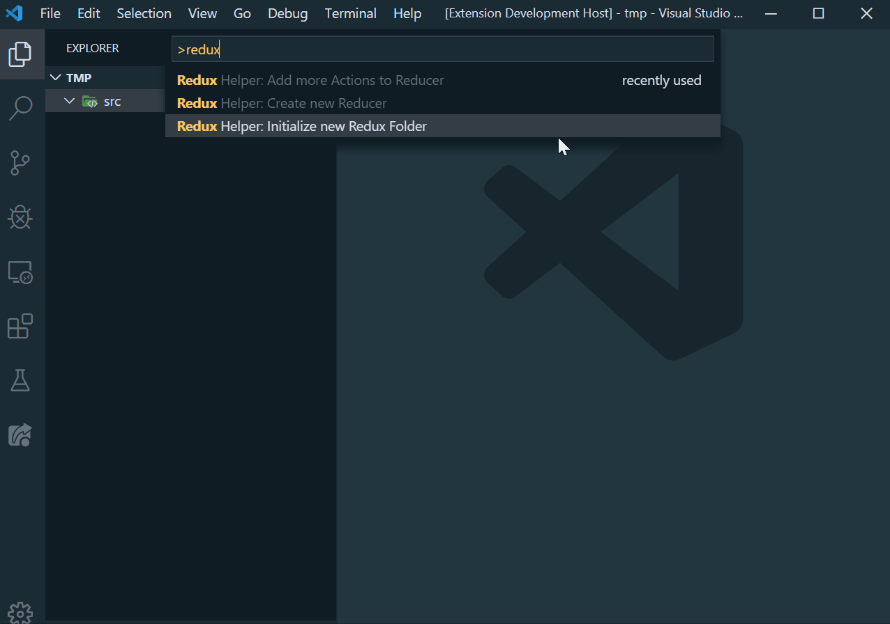

## Reduce Redux Boilerplate!!
# redux-helper

This extension helps with redux boilerplating. It automates the process of creating and adding all types of actions.

Works also with saga and redux thunk (if in own file)

## Features
* Create Typesafe ActionTypes, ActionCreators and Reducer with one command
* Create Actions for usage in Async Environments with just one line
* Add new Actions, ActionTypes and Reducer entries to existing Reducers (only if initialized by this extension)

# preview

# Usage
1. To use first init the Redux project by running the init command.
2. Then create your first reducer by running the create reducer command.

# License

[MIT LICENSE](./LICENSE)

